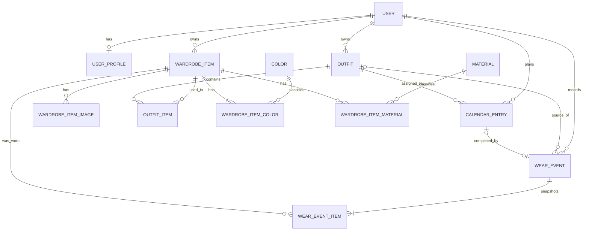

# Capsular: domain model and database v1

Status: ready for MVP implementation  
Database: PostgreSQL  
ORM: Prisma  
Related files: `schema.prisma` and `prisma.config.ts`

## 1. Key decisions

1. `Saved Outfit` is not a separate entity. It is an `Outfit` with status `SAVED`.
2. The Dashboard has no dedicated table. It is a read model assembled from plans, outfits, clothing, and usage history.
3. `timesWorn`, `lastWorn`, `costPerWear`, outfit readiness, and the number of available outfits are computed. They are not stored as the primary source of truth.
4. Wearing an outfit creates a `WearEvent` and a copy of its current composition in `WearEventItem`. Later outfit edits do not change the history.
5. Clothing and outfits with history are not physically deleted. The Delete operation in the application means archiving.
6. A user can plan at most one outfit for a given day. This is enforced by the uniqueness of `(user_id, planned_date)`.
7. The `Ready` state, laundry conflicts, and weather compatibility are domain-rule results, not columns in the `outfits` table.
8. Images are not stored in PostgreSQL. The database stores the Cloudinary asset identifier and its metadata.
9. Before saving, the backend normalizes email addresses with `trim().toLowerCase()`.
10. Weather data is not part of the MVP. Weather-related elements visible in the designs should be hidden behind a feature flag or use demo data until V2 is implemented.

## 2. Backend model layers

The backend should have three clearly separated data layers:

### Write models

Prisma models corresponding to PostgreSQL tables. They store facts such as a clothing item, an outfit assigned to a day, and a wear event.

### Domain logic

Proposed services:

| Service                       | Responsibility                                                          |
| ----------------------------- | ----------------------------------------------------------------------- |
| `OutfitCompositionService`    | Adding and removing items, layer order, and category validation         |
| `OutfitCompletenessService`   | Checking required slots before saving an outfit                         |
| `OutfitReadinessService`      | Availability of all items on the selected day                          |
| `WearTrackingService`         | Creating `WearEvent` and the `WearEventItem` snapshot in one transaction|
| `UsageStatsService`           | `timesWorn`, `lastWorn`, `costPerWear`, and outfit statistics            |
| `CalendarPlanningService`     | Assigning, replacing, and removing an outfit from a day                |
| `DashboardQueryService`       | Assembling today’s outfit, tomorrow, alerts, and the next seven days   |
| `SuggestionService`           | Simple suggestions for missing items from the available wardrobe       |
| `WeatherCompatibilityService` | V2 module that combines the forecast with outfit properties             |

### API read models

The API returns table data together with computed values. The frontend should not reimplement readiness rules or statistics.

## 3. Main entities and relationships



## 4. PostgreSQL tables

| Table                     | Purpose                                                                 |
| ------------------------- | ----------------------------------------------------------------------- |
| `users`                   | Account, email, password hash, and account status                       |
| `user_profiles`           | Personal data, body type, preferences, goals, and settings               |
| `auth_sessions`           | Hashes of session or refresh tokens                                      |
| `colors`                  | Controlled color dictionary used by filters                              |
| `user_favorite_colors`    | User’s favorite colors                                                   |
| `materials`               | Material dictionary, for example wool, cotton, and leather               |
| `wardrobe_items`          | Core data for an individual clothing item                               |
| `wardrobe_item_images`    | Cloudinary assets and image order                                        |
| `wardrobe_item_colors`    | Clothing colors with a primary, secondary, or accent role               |
| `wardrobe_item_materials` | Materials and optional composition percentage                           |
| `outfits`                 | Draft, saved, and archived outfits                                      |
| `outfit_items`            | Outfit composition, slot, and layer order                               |
| `tags`                    | User-defined labels, for example presentation or rainy commute           |
| `outfit_tags`             | Tags assigned to outfits                                                |
| `calendar_entries`        | An outfit assigned to a specific date                                   |
| `wear_events`             | The actual wearing of an outfit                                         |
| `wear_event_items`        | Snapshot of items worn during the event                                 |

## 5. Wardrobe Item

### Fields required on creation

| Field          | Meaning                                                        |
| -------------- | -------------------------------------------------------------- |
| `name`         | Name displayed in the wardrobe                                |
| `category`     | `TOP`, `BOTTOM`, `OUTERWEAR`, `SHOES`, or `ACCESSORY`          |
| primary color  | Exactly one `wardrobe_item_colors` record with role `PRIMARY` |
| `availability` | Defaults to `AVAILABLE`                                        |

An image may be technically optional. The absence of an image should not block adding an item.

### Additional fields missing from the single-item design

| Group           | Fields                                               | Why                                                        |
| --------------- | ---------------------------------------------------- | ----------------------------------------------------------- |
| Identification  | `subcategory`, `brand`, `size`, `description`        | Better item search and details                              |
| Appearance      | Additional colors, images                            | Filtering and future suggestions                            |
| Material        | `materials`, `percentage`                            | Practical information and future care rules                 |
| Use             | `seasons`, `occasions`                               | Filtering and outfit matching                               |
| Weather         | `warmthLevel`, `waterResistance`, `isWindResistant`  | Foundation for the V2 weather module                        |
| State           | `availability`, `availableFrom`, `unavailableReason` | Planning conflicts caused by laundry or unavailability      |
| Purchase        | `purchaseDate`, `purchasePrice`, `currencyCode`      | Calculating cost per wear                                   |
| Preferences     | `isFavorite`                                         | Quick access and suggestions                                |
| History import  | `wearCountBeforeTracking`, `lastWornBeforeTracking`  | Reasonable statistics for items owned before registration   |
| Lifecycle       | `archivedAt`                                         | Safe deletion without losing history                        |

### Computed fields in the API response

```ts
type WardrobeItemStats = {
  timesWorn: number;
  lastWornAt: string | null;
  costPerWear: {
    amount: string;
    currencyCode: string;
  } | null;
};
```

Rules:

```txt
timesWorn = wearCountBeforeTracking + number of WearEventItem records

lastWornAt = the later of:
lastWornBeforeTracking
max(WearEvent.wornAt)

costPerWear = purchasePrice / timesWorn
```

When `purchasePrice` does not exist or `timesWorn` is zero, `costPerWear` is `null`.

## 6. Outfit

### Stored data

| Field            | Meaning                                                                     |
| ---------------- | --------------------------------------------------------------------------- |
| `name`           | May be empty for a draft; required when status is `SAVED`                   |
| `description`    | Optional note                                                               |
| `status`         | `DRAFT`, `SAVED`, or `ARCHIVED`                                             |
| `isFavorite`     | The go-to outfits section and Favorites filter                              |
| `occasions`      | Work, Casual, Evening, Travel, Formal, or Sport                             |
| `seasons`        | Seasons to which the user assigned the outfit                              |
| `warmthOverride` | Manual override from 1 to 5 when the item-based calculation is inaccurate   |
| tags             | Custom contexts, for example `presentation`, `coffee-run`, `rainy-commute`  |
| items            | Outfit items with a role and layer order                                    |

### Slots and layers

`OutfitItem` has `slot` and `layerOrder`.

Example:

| Item      | Slot        | layerOrder |
| --------- | ----------- | ---------: |
| T-shirt   | `TOP`       |          0 |
| Overshirt | `TOP`       |          1 |
| Chinos    | `BOTTOM`    |          0 |
| Sneakers  | `SHOES`     |          0 |
| Coat      | `OUTERWEAR` |          0 |

Requirements for saving a complete outfit:

1. At least one `TOP`.
2. Exactly one `BOTTOM`.
3. Exactly one `SHOES`.
4. Any number of `OUTERWEAR` and `ACCESSORY` items.
5. The clothing category must match the slot.
6. The item must belong to the same user.
7. The item must not be archived.

A draft may be incomplete. An outfit with status `SAVED` must have a name and meet all requirements.

### Computed fields

```ts
type OutfitReadiness = 'INCOMPLETE' | 'READY' | 'LAUNDRY_CONFLICT' | 'ITEM_UNAVAILABLE';

type OutfitComputedData = {
  pieceCount: number;
  isComplete: boolean;
  readiness: OutfitReadiness;
  blockingItemIds: string[];
  warmthLevel: number | null;
  timesWorn: number;
  lastWornAt: string | null;
};
```

Simple V1 warmth rule:

```txt
warmthLevel = warmthOverride or the highest warmthLevel among the items
```

This provides predictable behavior because the outer layer usually determines the level of protection. The rule can be replaced in the future without a data migration.

### Readiness for a selected day

1. Missing required slots results in `INCOMPLETE`.
2. An archived or indefinitely unavailable item results in `ITEM_UNAVAILABLE`.
3. An item in the laundry that will not be available before the planned day results in `LAUNDRY_CONFLICT`.
4. If all items will be available, the result is `READY`.

`availableFrom` is a date and time. The backend compares it with the start of the planned day in the user’s time zone.

## 7. Calendar Entry

`CalendarEntry` represents one planning decision:

```txt
user + date + outfit + optional context
```

`contextLabel` supports content visible in the design, for example `Client presentation`. No separate type is needed for these labels.

The day status is not stored:

| UI state         | How it is derived                               |
| ---------------- | ----------------------------------------------- |
| Unplanned        | No `CalendarEntry` exists for the date         |
| Ready            | An entry exists and the outfit is `READY`      |
| Laundry conflict | An entry exists and readiness is `LAUNDRY_CONFLICT` |
| Worn             | A `WearEvent` is linked to the entry            |

If the product later needs to support multiple outfits per day, remove the uniqueness of `(user_id, planned_date)` and add `position` or a time range. For the current screens, one outfit per day is the right constraint.

## 8. Wear Event and history

Clicking `Wear it` executes one transaction:

1. The backend fetches the outfit together with its active items.
2. It checks completeness and readiness again.
3. It creates a `WearEvent`.
4. For each item, it creates a `WearEventItem` with the clothing ID, slot, layer order, name, and category at the time of wearing.
5. It optionally links the event to a `CalendarEntry`.

Do not perform separate operations such as `item.timesWorn += 1`. The count is derived from history records, so retrying a request must not accidentally increase it multiple times. The endpoint should accept an `Idempotency-Key` or use a unique `calendarEntryId`.

## 9. User profile

### Account data

`email` is stored in `users`. Passwords never enter the database. Only `passwordHash` is stored, preferably using Argon2id.

### Optional data

`user_profiles` includes:

1. First and last name.
2. Date of birth, country, city, and time zone.
3. Unit system, height, weight, and body type.
4. Preferred styles and typical occasions.
5. Shopping frequency and price sensitivity.
6. Goals and the stage of building a capsule wardrobe.

Favorite colors have a separate relationship to `colors`, allowing the profile and wardrobe to use the same palette.

## 10. What we intentionally do not store

| UI data                                  | Reason                                                       |
| ---------------------------------------- | ----------------------------------------------------------- |
| `Dashboard`                              | An aggregation, not a domain fact                           |
| `Capsule efficiency 92%`                 | The formula is not yet defined and will change               |
| `32 items`, `18 outfits`, `4 in laundry` | Simple aggregates                                           |
| `Ready`, `Laundry conflict` on outfits   | The result depends on the day and current availability       |
| `Needs attention`                        | A dynamic result of planning, availability, and, in V2, weather |
| Suggest alternatives                     | An algorithm result, not persistent data                    |
| `timesWorn`, `lastWorn`                  | A result of `WearEvent` history                             |
| `costPerWear`                            | A result of price and usage history                         |
| Composite outfit thumbnail               | The frontend builds it from item images                     |

If optimization is needed later, these values can be moved to a materialized view or cache table. The cache must not become the source of truth.

## 11. Required PostgreSQL rules outside Prisma

Prisma does not describe all constraints. The first migration should add:

```sql
CREATE UNIQUE INDEX wardrobe_item_one_primary_color
ON wardrobe_item_colors (wardrobe_item_id)
WHERE role = 'PRIMARY';

ALTER TABLE wardrobe_items
ADD CONSTRAINT wardrobe_items_warmth_check
CHECK (warmth_level IS NULL OR warmth_level BETWEEN 1 AND 5),
ADD CONSTRAINT wardrobe_items_purchase_price_check
CHECK (purchase_price IS NULL OR purchase_price >= 0),
ADD CONSTRAINT wardrobe_items_wear_count_check
CHECK (wear_count_before_tracking >= 0);

ALTER TABLE outfits
ADD CONSTRAINT outfits_warmth_override_check
CHECK (warmth_override IS NULL OR warmth_override BETWEEN 1 AND 5);

ALTER TABLE outfit_items
ADD CONSTRAINT outfit_items_layer_order_check
CHECK (layer_order >= 0);

ALTER TABLE wardrobe_item_images
ADD CONSTRAINT wardrobe_item_images_position_check
CHECK (position >= 0);

ALTER TABLE wardrobe_item_materials
ADD CONSTRAINT wardrobe_item_materials_percentage_check
CHECK (percentage IS NULL OR percentage BETWEEN 1 AND 100);

ALTER TABLE users
ADD CONSTRAINT users_email_normalized_check
CHECK (email = lower(trim(email)));

ALTER TABLE colors
ADD CONSTRAINT colors_hex_check
CHECK (hex ~ '^#[0-9A-Fa-f]{6}$');
```

The completeness requirements for a `SAVED` outfit span multiple records. The cleanest approach is to check them in the domain service within the same transaction that changes the status to `SAVED`.

## 12. Indexes and queries

The schema includes indexes for the most common screens:

1. Wardrobe by `user_id`, category, availability, favorites, and `archived_at`.
2. Outfits by user, status, and favorites.
3. Calendar by user and date.
4. Usage history by user and `worn_at`.
5. Item statistics by `wardrobe_item_id` in `wear_event_items`.

Initially, a regular `ILIKE` query on the clothing name is sufficient. A capsule wardrobe has few records per user. Add `pg_trgm` only after a performance problem has been confirmed.

## 13. Transaction boundaries

| Operation         | What must execute atomically                                                               |
| ----------------- | -------------------------------------------------------------------------------------------- |
| Create item       | Clothing item, primary color, materials, and metadata for the previously uploaded image    |
| Save outfit       | Item ownership and completeness validation, and the status change                          |
| Assign to day     | Outfit validation and `CalendarEntry` upsert                                                 |
| Wear it           | `WearEvent`, all `WearEventItem` records, and the calendar link                              |
| Mark laundry done | Updating `availability`, `availabilityChangedAt`, and clearing `availableFrom` and the reason |
| Archive item      | Checking the impact on active outfits and future plans, then setting `archivedAt`           |

## 14. Multi-user security

Every command and query must be scoped by the `userId` obtained from the session. The backend must not trust `userId` from the request body.

When creating `OutfitItem`, `CalendarEntry`, `WearEvent`, and tags, verify that all related records belong to the authenticated user. Foreign keys confirm that a record exists, but not who owns it.

The session token or refresh token is not stored directly. `auth_sessions.token_hash` stores only its hash, enabling session rotation and revocation.

## 15. Post-MVP extensions

### Weather V2

Start with an external adapter and a short-lived cache. Add `weather_forecasts` only when forecast history is needed. Compatibility should still be computed.

### Laundry V2

If a laundry queue and history are needed, add `laundry_cycles` and `laundry_cycle_items`. The current `availability` and `availableFrom` are sufficient for MVP conflicts.

### Analytics V3

Statistics are derived from `wear_events`. At larger scale, materialized views can be added, such as daily usage of items and outfits.

### AI V4 and V5

Image-analysis results should be suggestions for approval. After acceptance, they go into the clothing item’s regular fields. Do not create a separate parallel wardrobe model for AI.

### Purchase Simulator V6

A purchase candidate should be a separate `purchase_candidates` entity, not a `wardrobe_items` record, because the user does not own it yet. Simulated outfits can be calculated temporarily and saved only after purchase.

## 16. Approved MVP decisions

Decisions approved on July 14, 2026:

1. Weather integration remains outside the MVP and is part of V2.
2. A user can assign at most one outfit to a day.
3. Accessories are optional outfit items and do not affect completeness.
4. Importing the initial wear count of an older clothing item is optional. No value means zero previous wears.
5. The Delete operation means archiving. Historical data, statistics, and previous wear events remain preserved.

## 17. Prisma 7 configuration

The schema is prepared for Prisma 7. The database connection is in `prisma.config.ts`, not in the `datasource` block of `schema.prisma`. The `prisma-client` generator writes generated code to `src/generated/prisma`.

Target backend structure:

```txt
backend/
  prisma.config.ts
  prisma/
    schema.prisma
    migrations/
  src/
    generated/
      prisma/
```

After moving the files into the structure above, set the `./prisma/schema.prisma` and `./prisma/migrations` paths in `prisma.config.ts`. Keep the `../src/generated/prisma` output in `schema.prisma`.

The process running Prisma must have `DATABASE_URL` set. If the backend uses a local `.env` file, install `dotenv` and add `import "dotenv/config"` at the beginning of `prisma.config.ts`.
